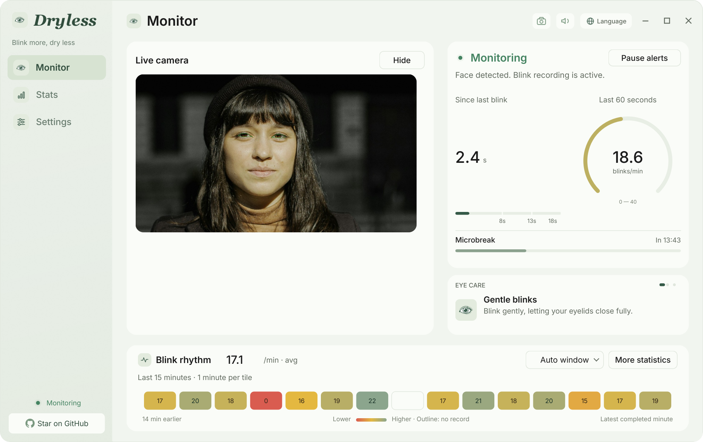
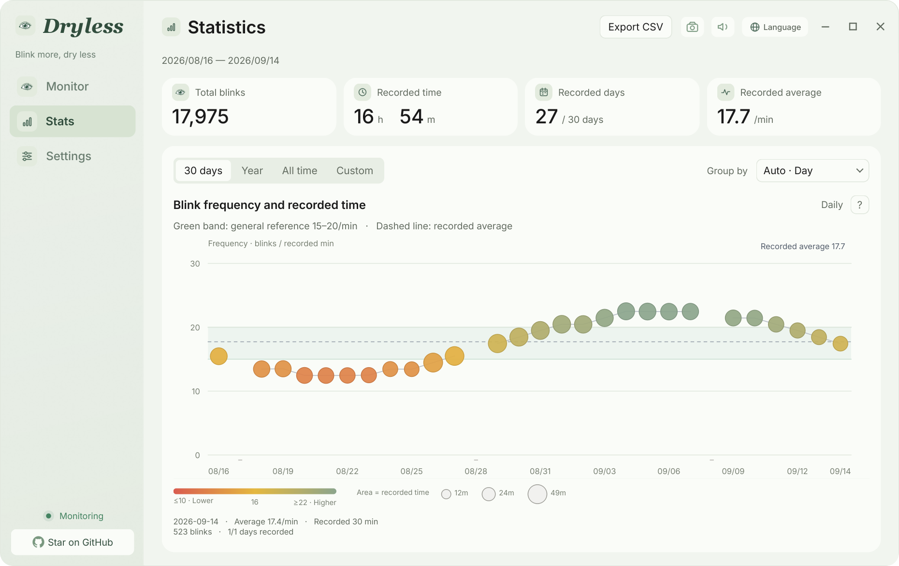
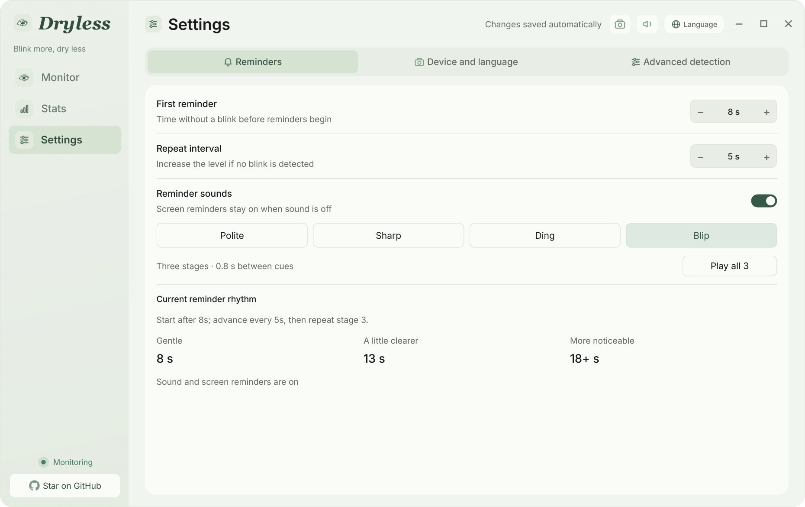
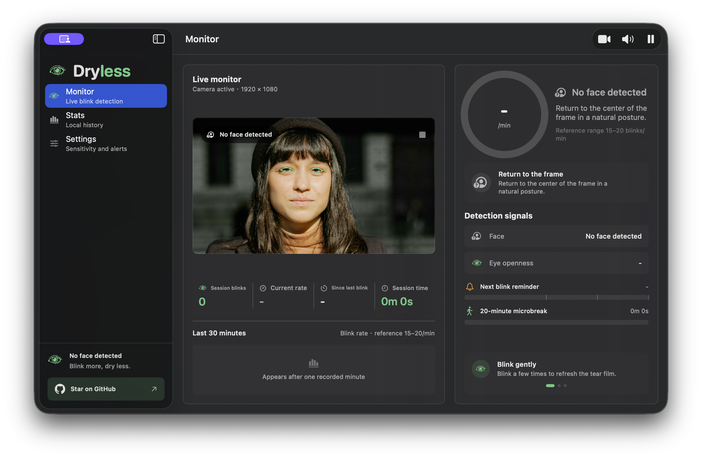
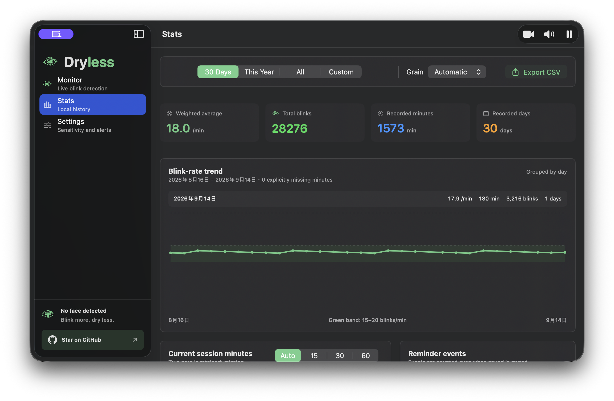
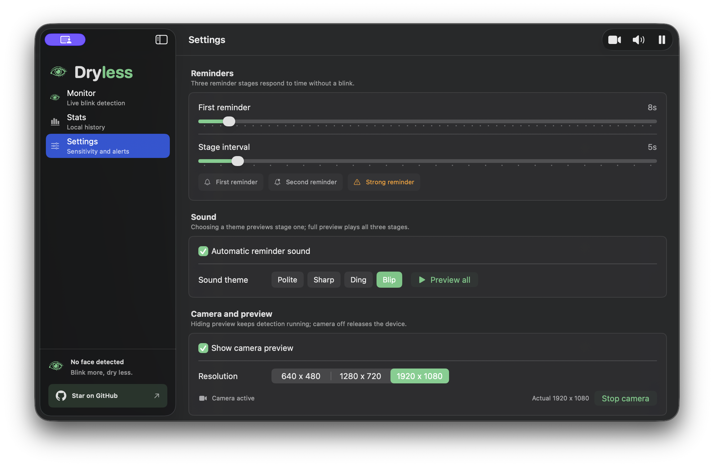

# Dryless

[English](README.md) · [简体中文](README.zh-CN.md)

**Blink more, dry less.**

**多一点轻眨，少一点疲乏。**

Dryless is a local-first desktop companion that records blink rhythm, escalates
gentle blink reminders, and suggests a microbreak after sustained presence.
It has native Windows and macOS implementations: the product behavior is
shared, while each platform keeps the interaction and window conventions of
its operating system.

Camera frames are analysed in memory on the device. Dryless does not upload or
store camera photos, video, or facial templates; it keeps only settings and
numeric minute-level blink history locally.

## Download

The official builds are published together on the
[GitHub Releases page](https://github.com/yuejianli-z/Dryless/releases):

- **Windows 10/11 x64:** `Dryless-0.2.0-windows.exe`
- **macOS 14 or later:** `macos/release/Dryless.app`

The Windows EXE is an attached GitHub Release file. The macOS build is a
directly runnable App bundle tracked at `macos/release/Dryless.app`; download
or clone the repository on a Mac, then open that bundle. Checksums and
platform-specific notes accompany the release source.

## Interface previews

These are screenshots of the native Windows and macOS apps. Each image is shown
at the full README content width, in the order Monitor, Stats, then Settings.
The monitor images use the credited public portrait and contain no private
camera capture.

### Windows

#### Monitor



#### Stats



#### Settings



### macOS

#### Monitor



#### Stats



#### Settings



## What both platforms do

- Start or release the local camera explicitly; hiding preview, pausing alerts,
  muting sound, and stopping the camera remain separate controls.
- Count blink events from local face and eye measurement, then show a rolling
  60-second rate and fixed one-minute rhythm cells. A rate requires at least
  30 seconds of valid eye-detection time; a real zero and missing data remain
  distinct.
- Escalate blink reminders through exactly three levels: first, second, and
  stronger. The third level repeats until a blink or state change resets it.
- Offer Polite, Sharp, Ding, and Blip sound themes. Selecting a theme previews
  its first stage; **Preview all 3** plays the three stages in order.
- Trigger a single 20-minute microbreak prompt after continuous detected
  presence. It temporarily takes priority over blink reminders while detection
  and numeric recording continue.
- Keep minute history locally, aggregate by hour/day/week/month, and export
  CSV. The interface is available in English and Simplified Chinese.
- Stay available in the Windows notification area or macOS menu bar for camera,
  pause, sound, open-window, and quit controls.

The detailed behavior contract is maintained in
[docs/FEATURE_PARITY.md](docs/FEATURE_PARITY.md).

## Platform implementations

| Platform | Runtime | Source | Development validation |
| --- | --- | --- | --- |
| Windows | Python / PyQt6 / MediaPipe | [Windows app](main.py) | [release note](docs/RELEASE.md) |
| macOS | SwiftUI / AVFoundation / Vision | [macOS app](macos/) | [release note](docs/RELEASE.md) |

### Windows development

The Windows 0.2.0 build uses Python 3.14 x64. From the
repository root:

```powershell
python -m venv .venv
.venv\Scripts\python -m pip install -r requirements-windows.lock
.venv\Scripts\python -m unittest discover -s tests -v
.venv\Scripts\python main.py
.venv\Scripts\python build.py
```

`build.py` writes a versioned portable executable under `dist/`; it does not
overwrite previous build directories. The package uses a temporary profile for its
`--self-test` and `--camera-smoke` checks, so those commands do not modify
personal history or save camera frames.

### macOS development

Dryless for macOS requires macOS 14 or later and a compatible Apple Swift
toolchain. From the repository root:

```bash
cd macos
swift build --product DrylessMac
swift run DrylessCoreChecks
./script/build_and_run.sh
./script/package_release.sh
```

The helper stages a development app at `macos/dist/Dryless.app`.
`package_release.sh` creates the directly runnable App bundle at
`macos/release/Dryless.app` on a Mac.

## Release integrity

Source stays in Git; the Windows executable is attached to the matching GitHub
Release, and the directly runnable macOS App bundle is kept at
`macos/release/Dryless.app`. See the single [release note](docs/RELEASE.md).
Do not treat a successful build or a preview image as camera-accuracy evidence.

## Documentation artwork credit

The README monitor previews use **“Woman looking at the camera”** by
[Marek Pospisil](https://unsplash.com/photos/woman-looking-at-the-camera--wTtFwEfvZo),
licensed under the [Unsplash License](https://unsplash.com/license). The
source image and usage boundary are recorded in
[docs/readme-assets/README.md](docs/readme-assets/README.md).

## License and notices

Dryless-owned source is released under the [MIT License](LICENSE). Third-party
components keep their own terms. In particular, the packaged Windows PyQt6
application includes GPLv3 components and is not an MIT-only executable; see
[THIRD_PARTY_NOTICES.md](THIRD_PARTY_NOTICES.md) and bundled notices before
redistributing a package.

## Contributing

Keep the product contract aligned across platforms without forcing identical
pixel layouts. Do not add camera captures, personal data, generated history,
or README artwork to either runtime target. Read
[docs/FEATURE_PARITY.md](docs/FEATURE_PARITY.md) before changing shared behavior.
