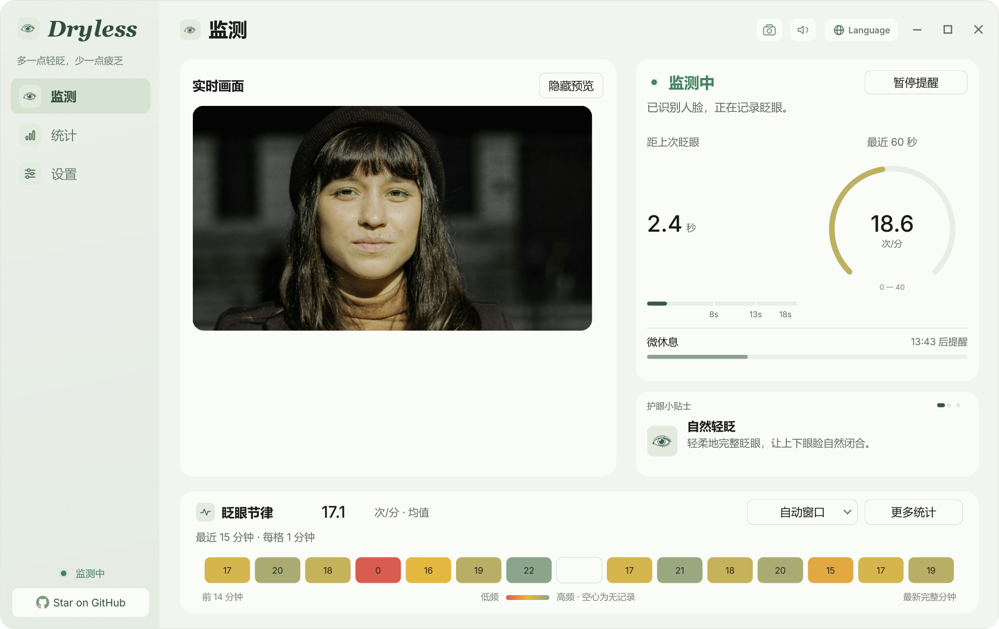
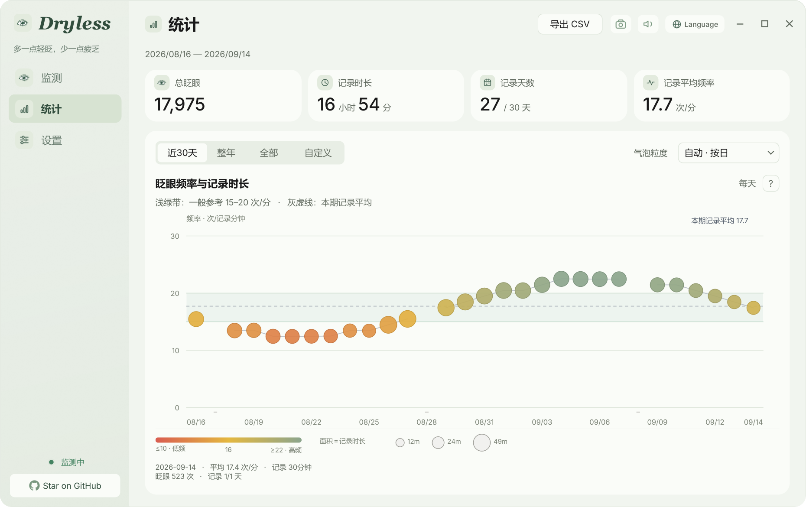
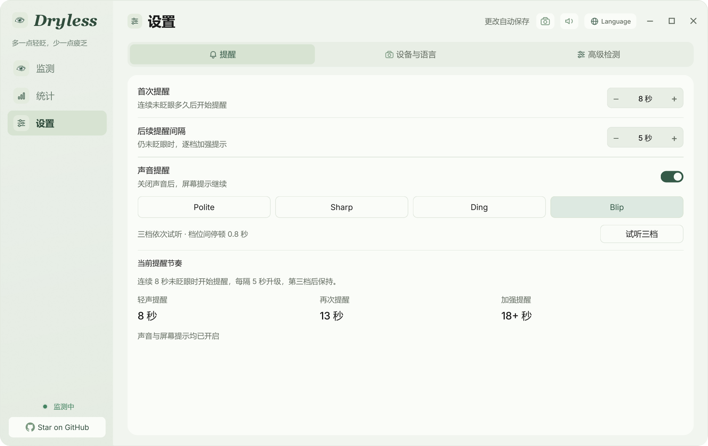
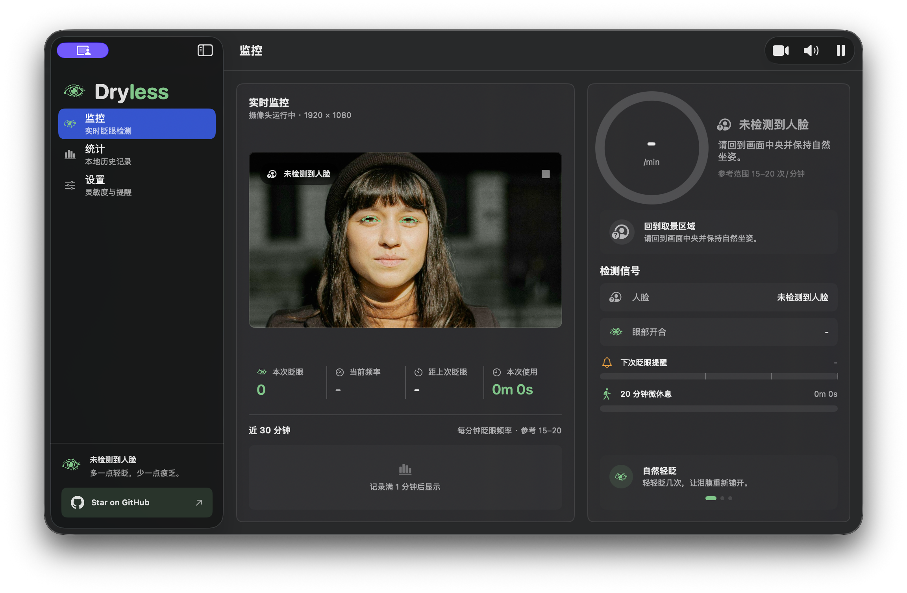
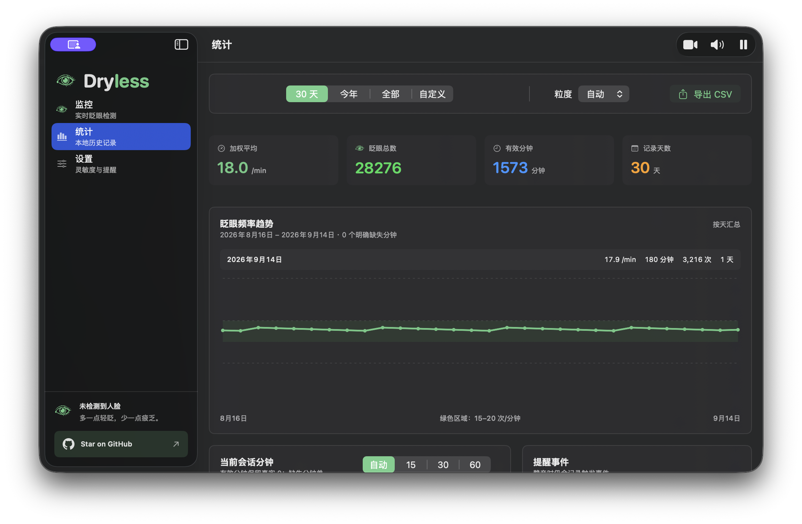
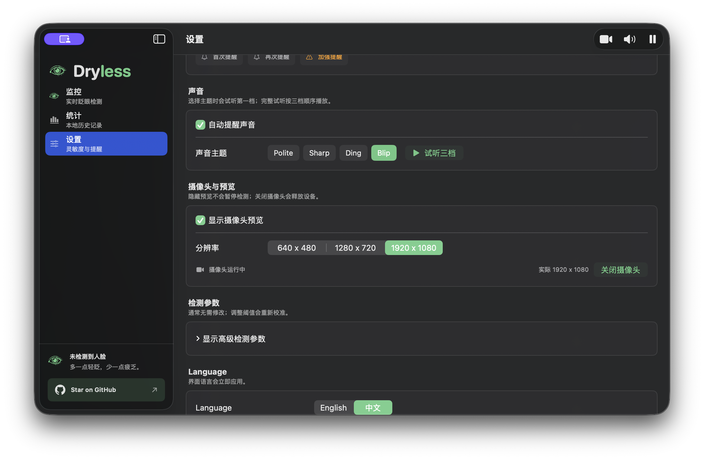

# Dryless

[English](README.md) · [简体中文](README.zh-CN.md)

**Blink more, dry less.**

**多一点轻眨，少一点疲乏。**

Dryless 是一款本地优先的桌面护眼伴侣：记录眨眼节律、分级提示轻眨，并在持续用眼后提示微休息。Windows 与 macOS 都有原生实现；功能逻辑保持一致，界面与系统交互各自遵循平台习惯。

摄像头画面只在设备内存中分析。Dryless 不上传或保存照片、视频、面部模板；本地仅保留设置和按分钟统计的数值记录。

## 下载

Windows 与 macOS 的正式构建会一起发布在 [GitHub Releases](https://github.com/yuejianli-z/Dryless/releases)：

- **Windows 10/11 x64：** `Dryless-0.2.0-windows.exe`
- **macOS 14 或更高版本：** `macos/release/Dryless.app`

Windows EXE 作为 GitHub Release 附件发布。macOS 是直接可运行的 App 包，位于 `macos/release/Dryless.app`；在 Mac 上下载或克隆仓库后即可打开。校验值和平台说明随 Release 源码提供。

## 界面预览

以下为 Windows 与 macOS 原生应用的中文界面截图。每张图片独占一行并按 README
内容区全宽展示；每个平台均按监测、统计、设置排列。监测页使用下方注明来源的
公开人像，不含私人摄像头画面。

### Windows

#### 监测



#### 统计



#### 设置



### macOS

#### 监测



#### 统计



#### 设置



## 两端共有的功能

- 摄像头由用户明确开启或释放；隐藏预览、暂停提醒、静音、关闭摄像头是彼此独立的控制。
- 基于本地人脸与眼部测量记录眨眼事件，展示 60 秒滑动频率和固定一分钟的节律格。频率至少需要 30 秒有效眼部识别时间；真实的零与无记录严格区分。
- 眨眼提醒只有三级：首次、再次、加强；第三级会持续，直到眨眼或状态变化后重置。
- 提供 Polite、Sharp、Ding、Blip 四组声音。切换音色会播放第一档；**试听三档**会按顺序播放全部三级。
- 连续识别到在场 20 分钟后触发一次微休息提示；微休息提示优先于眨眼提醒，但检测和数值记录仍会继续。
- 按分钟把历史保存在本地，可按小时/天/周/月汇总并导出 CSV；界面支持英文和简体中文。
- Windows 常驻通知区域，macOS 常驻菜单栏，可快速控制摄像头、暂停、声音、打开窗口和退出。

完整行为约定见 [docs/FEATURE_PARITY.md](docs/FEATURE_PARITY.md)。

## 平台实现

| 平台 | 技术栈 | 源码 | 开发验证记录 |
| --- | --- | --- | --- |
| Windows | Python / PyQt6 / MediaPipe | [Windows 应用](main.py) | [发布说明](docs/RELEASE.md) |
| macOS | SwiftUI / AVFoundation / Vision | [macOS 应用](macos/) | [发布说明](docs/RELEASE.md) |

### Windows 开发

在仓库根目录执行：

```powershell
python -m venv .venv
.venv\Scripts\python -m pip install -r requirements-windows.lock
.venv\Scripts\python -m unittest discover -s tests -v
.venv\Scripts\python main.py
.venv\Scripts\python build.py
```

`build.py` 会在 `dist/` 中生成带版本号的便携 EXE，不会覆盖旧候选包。`--self-test` 与 `--camera-smoke` 使用临时配置目录，不会改动个人历史，也不会保存摄像头画面。

### macOS 开发

需要 macOS 14 或更高版本与兼容的 Apple Swift 工具链。进入仓库后执行：

```bash
cd macos
swift build --product DrylessMac
swift run DrylessCoreChecks
./script/build_and_run.sh
./script/package_release.sh
```

前一条脚本在 `macos/dist/Dryless.app` 生成开发应用；`package_release.sh` 会在 Mac 的 `macos/release/Dryless.app` 生成直接可运行的 App 包。

## 发布完整性

源码保存在 Git；Windows 可执行文件作为 GitHub Release 附件发布，macOS 可直接运行的 App 包保存在 `macos/release/Dryless.app`。详见唯一的[发布说明](docs/RELEASE.md)。成功构建或文档预览不代表摄像头识别精度已被证明。

## 文档图片授权

README 监测页预览使用 **“Woman looking at the camera”**，作者 [Marek Pospisil](https://unsplash.com/photos/woman-looking-at-the-camera--wTtFwEfvZo)，授权为 [Unsplash License](https://unsplash.com/license)。原图和使用边界记录在 [docs/readme-assets/README.md](docs/readme-assets/README.md)。

## 许可证与声明

Dryless 自有源码采用 [MIT License](LICENSE)。第三方组件遵循各自许可证；特别是打包后的 Windows PyQt6 应用包含 GPLv3 组件，不能把整个可执行文件当作纯 MIT 作品分发。详见 [THIRD_PARTY_NOTICES.md](THIRD_PARTY_NOTICES.md) 与包内声明。

## 贡献

跨平台应保持产品逻辑一致，不强行复制像素布局。不要把摄像头捕获、个人数据、生成的历史记录或 README 图片放入任一运行时目标。修改共享逻辑前请先阅读 [docs/FEATURE_PARITY.md](docs/FEATURE_PARITY.md)。
